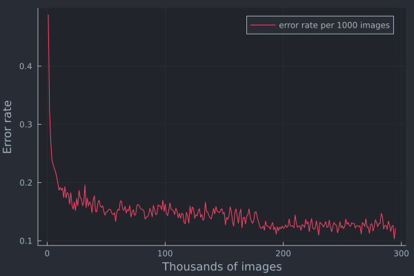

### Success rate on test data: 88%

#### 784 | 64 tanh | 10 tanh, MLP

Currently, this artificial neural net (ANN) is forward-feeding, fully connected, and has one hidden layer, commonly referred to as a multi-layer perceptron (MLP).
I tried a variety of eta and alpha values in various training schedules, but anything further than five epochs plateaued or degraded performance.
The net's reluctance to improve is likely because the output layer uses the hyperbolic tangent function instead of one better suited to classification-type problems.

### Training performance

